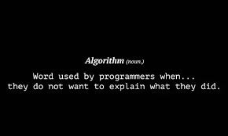

# py-algo-n-ds
Solution to interesting algorithm and data structure problem using Python 3

*Why Python ?*

### Requirements
- Python 3.8.x
- tcl-tk for tree visualization. You will find it very helpful for [tree problems](./trees). see [Setup Instructions](https://medium.com/@azuryn/install-python-by-pyenv-w-tcl-tk-on-macos-10-14-6-mojave-14fde5351f53)

