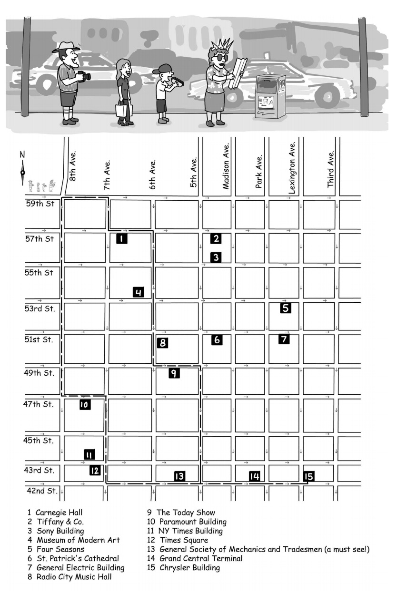

## Manhatten tourist problem

Imagine a sightseeing tour in the borough of Manhattan in New York City,
where a group of tourists are determined to walk from the corner of 59th
Street and 8th Avenue to the Chrysler Building at 42nd Street and Lexington Avenue. There are many attractions along the way, but assume for the
moment that the tourists want to see as many attractions as possible.   
The tourists are allowed to move either to the south or to the east, but even so,
they can choose from many different paths

Find the maximum number of attractions they can see and the path to see the maximum attractions.